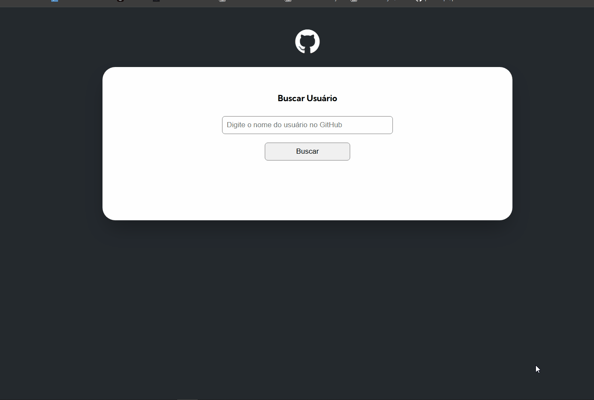

# Projeto--fetch-github-api

## Descrição 
Este projeto com consumo de API do GitHub tem como objetivo, treinar minha habilidade com javaScrip e aprimora-las.

## Funcionalidades
Procura usuário com seu nome de usuário do GitHub, buscando informações de:
- Imagem de perfil
- Nome 
- Bio
- Repositorios

Input de pesquisa possui verificação de conteúdo, e a busca de usuário tambem tem validação, caso nao encontrado gera mensagem "Usuário não encontrado😯".

## Tecnologias utilizadas

- HTML
- CSS
- JavaScript
- Consumo API GitHub

## Demonstração do Projeto

